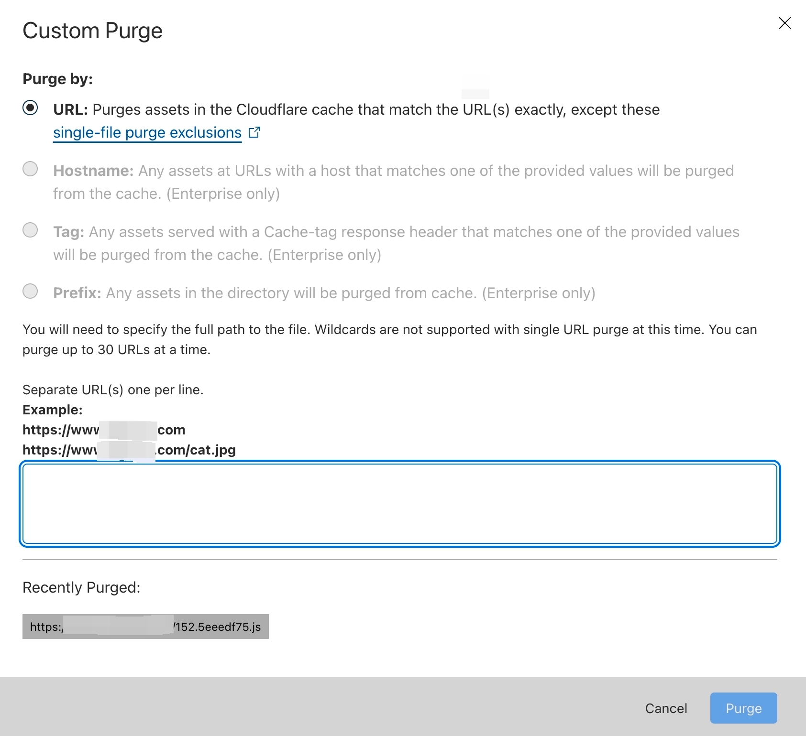
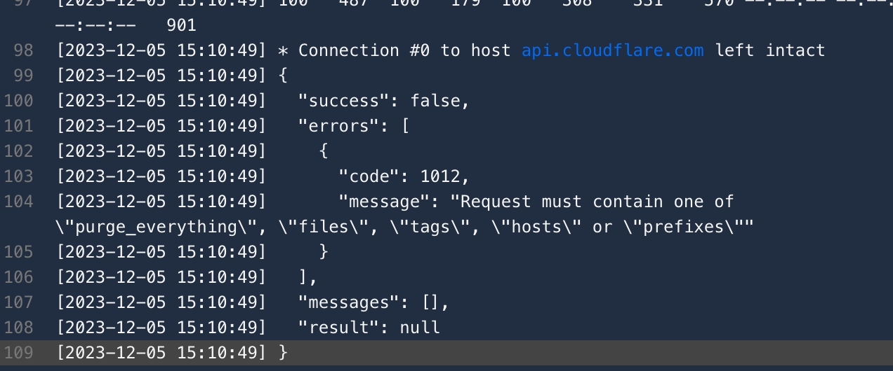
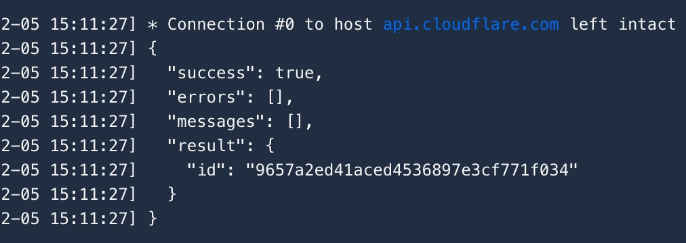

几个星期前，我接到一个任务是要通过 CI/CD 把我们的应用通过我们的构建机器打包📦，并且在打包完成后将它推送到 AWS 的 S3 存储。

当我把整个 CI/CD 的构建计划完整的弄好以后，我满怀期待的下载应用下来安装校验新的 commit 是否有效的时候，却发现尽管 CI/CD 上显示的是用的最新的 commit 来打包，但是应用安装完后打开却并没有看到预期的效果，即使我新打开一个无痕浏览器下载也是一样。

因为在现代 Web 开发中，除了浏览器的缓存（Browser Cache）以外，还有一种缓存 CDN 缓存。

像我这次遇到的问题就是因为上传的应用是传到了 Amazon 的 S3 存储。而 CDN 服务是 Cloudflare 的。

问题很简单，只需要在应用传上去后刷新 CDN 缓存就好。

但公司的 Cloudflare 账号只有一个，不像 Amazon 那样可以通过 AWS Identity and Access Management 来创建一个账号针对某项资源做操作。

每次 CI/CD 完成后还要人工去刷新缓存好像也不是那么的很自动化🤔。

💡 通过 token 调用 Cloudflare 的 API 来实现刷新缓存。只需要一个 curl 就可以解决这个问题😄，轻松加愉快。

但是文档里面找到这个刷新缓存的 api 后真正调用起来却遇到了问题。

[Purge Cached Content](https://developers.cloudflare.com/api/operations/zone-purge) 这个 API 虽然看描述说可以清空缓存，但是看它所支持的参数，好像并不支持刷新指定文件，我不想刷新所有缓存，毕竟我只是上传了几个应用的安装包到 S3 上。
但是在 Cloudflare 的 Custom Purge 页面上是可以支持刷新特定 URL 的。



就在一筹莫展，准备实在不行那我就整个都刷新掉嘛，好像也不是不行😇。突然想到是不是他有可能其实是支持的，但是只是文档没有更新而已，于是就尝试在传参里面带上 urls，把我需要刷新的 url 传过去看可不可以。

```bash
curl -v --request POST \
	--url https://api.cloudflare.com/client/v4/zones/identifier/purge_cache \
	--header 'Content-Type: application/json' \
	--header "X-Auth-Email: $AUTH_EMAIL" \
	--header "X-Auth-Key: $CLOUDFLARE_API_KEY" \
	--data '{
	"urls": [
	"https://assets.example.com/download/App-windows-latest.zip",
	"https://assets.example.com/download/App-macOS-latest.zip",
	"https://assets.example.com/download/App-macOS-arm64-latest.zip"
	]
}'
```

那不出所料，没有成功😇。但是他却返回了关键信息，告诉了我有哪些参数是合法的，而不是就一个很抽象的报错，说我参数错误🤯。



多亏了这个关键的错误信息，我把 urls 换成 files 后，请求就成功了，后面试着下了一个新的也成功的验证到新的 commit 生效🎉



要是这个 API 返回来的错误信息是什么 Invalid Param 或者 Internal Server Error 之类的那估计又要在网上找半天可能才会找到答案吧 🤣


## Reference
[CDN](https://en.wikipedia.org/wiki/Content_delivery_network)

[Amazon CloudFront](https://aws.amazon.com/cloudfront/)

[Purge Cached Content](https://developers.cloudflare.com/api/operations/zone-purge)
